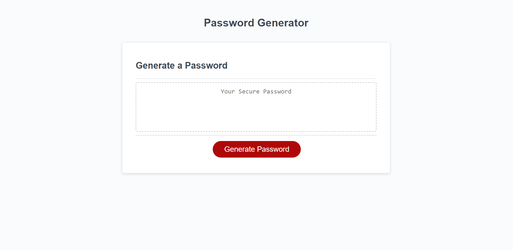

# Password Generator

## Description

This password generator is a simple tool to helps you create strong and secure passwords that meet your criteria with the click of a button.

## Features

-   Generates strong passwords with various password sets (Uppercase Letters, Lowercase Letters, Numbers, and Special characters).
-   Customize pasword length withing the range of 8 to 128 characters.

## Usage

1. Open your web browser and navigate to the Password Generator website. [Website Link](https://masonschnell.github.io/password-generator/)
2. Click the "Generate" button and answer the prompts to fill out your password preferences.
3. The generated password will appear in the "Your Secure Password" window.

## Contact Information

-   Email: masonschnell1@gmail.com
-   GitHub: MasonSchnell

## Acknowledgments

-   Rutgers Full Stack Development Team

## Liscence

This portfolio is available through the MIT License.
